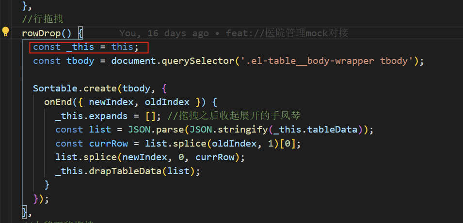
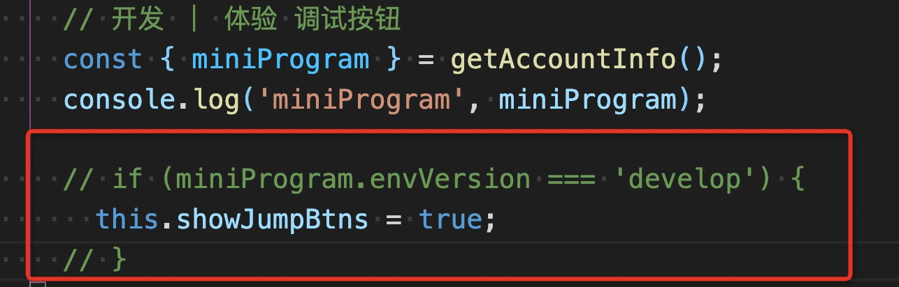
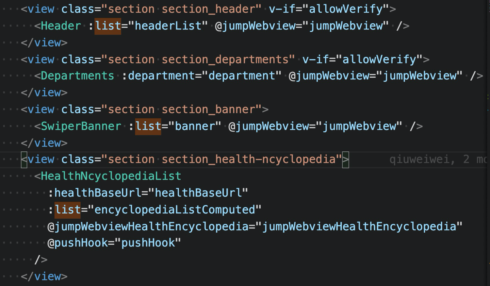

# xxx 项目 CodeReview 文档

| **类目** | **说明** |
| --- | --- |
| 项目 | 例如：商城 mall：[https://github.com/qiuwww/safety-in-production-of-FE.git](https://github.com/qiuwww/safety-in-production-of-FE.git) |
| 发布版本 | 例如：小程序兼容商城：qatest-mp-2.2.0 |
| 当前状态 | 提测 |
| 发布日期 | 2021.4.29 |
| review 代码范围 | 如：feat: 发布到预发 8c90e01 qiuwww <1014913222@qq.com> 2021 年 4 月 28 日 23:15 |
| 参与人员 | 相关联的人员 |

**记录：**

1. 一般的问题，如：注意 this 变量的指向，使用箭头函数替换（添加截图）；
   - 
   - 修改：这里写明后续的修改操作
2. 需要修改后，才能发布的问题，需要红色标注，如下（开发工具中的代码不应发布到小程序体验版本）；
   - 
   - 修改：这里写明后续的修改操作
3. 写的比较好的地方，使用蓝色标注，举例如下（切分页面模块，合理组织页面结构）；
   - 
